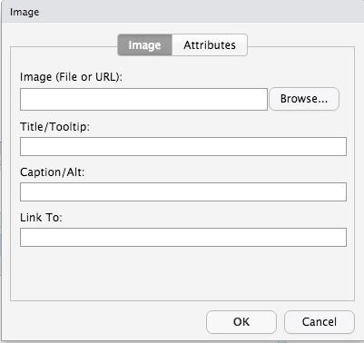
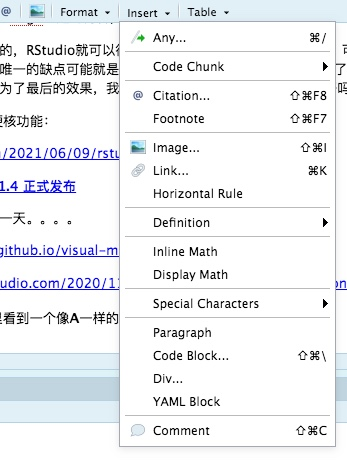
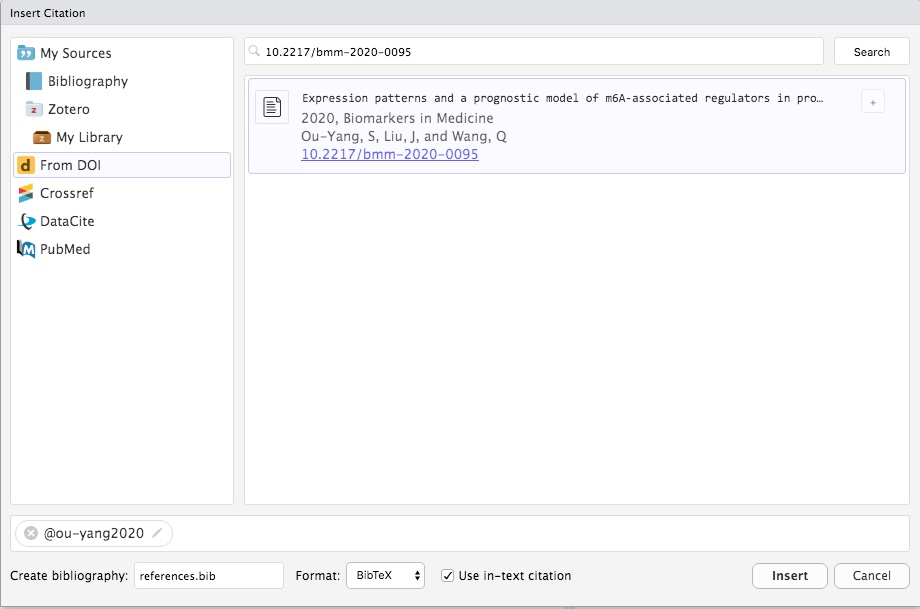

最近一直在学习用**RStudio**建博客和写文章或书什么的，有了`Rmarkdown`的支持，可以渲染很有有用的可视化效果，但是很多语句都是基于`markdown`语言来写的，虽然markdown作为一款轻量级的语言，很适合用来写东西，而不是来排版，但是一直用代码，也是很烦人的，尤其我又是一个懒人，我要的是效果，而不是代码。

虽然有很多在线编辑器，也有`Typora`这种可视化的软件支持，但都是拆东墙补西墙的办法，没有一款软件就能解决所有问题，比如我要搭博客，以前需要安装各种软件，需要各种代码，有了**yihui**大神的支持，把很多东西都合成在RStudio里面，尤其嵌入了R markdown以后就可以很好的渲染R语言的效果，可以写word，可以写PPT，甚至还可以写期刊论文，节省了很多复制粘贴的工作，而且配合<u>bookdown</u>以后还可以很好的写书，<u>pagedown</u>可以很好的编辑网页，然后又开发了<u>blogdown</u>，一步就可以配置hugo主题的博客，简直不要太方便。

我一直觉得用一款软件把大多数的工作完成是最好的，RStudio就可以很好的完成这些工作，可以用来统计，可以用来画图，可以用来写作，还可以用来搭博客，之前唯一的缺点可能就是对markdown原生态语句不能可视化了，毕竟我不是一个活在想象世界中的人，写代码的目的是为了最后的效果，我又不是码字🐶，能用简单的办法不好吗？

> 目前RStudio更新到1.4版，新增了很多实质性的硬核功能：
>
> 其中英文版介绍可见，<https://blog.rstudio.com/2021/06/09/rstudio-v1-4-update-whats-new/>
>
> 中文版在知乎上也有介绍，具体看这里[**RStudio v1.4 正式发布**](https://zhuanlan.zhihu.com/p/345804036)
>
> 其中最让有**两个功能**最让我兴奋，又是解放双手的一天。。。。
>
> - [x] Rmarkdown编辑可视化<https://rstudio.github.io/visual-markdown-editing/>
>
> - [x] 支持可视化插入参考文献<https://blog.rstudio.com/2020/11/09/rstudio-1-4-preview-citations/>

新版的RStudio打开md文件后，可以在编辑界面里看到一个像**A**一样的东西，不点它就这样

点一下最右边的那个A就这样

而且插入图片可以直接点击上面的那个图片的符号，选好图片就出现效果了，可以自动添加标题和链接

而且点一下图片，还可以直接编辑图片大小，真好 

在Insert那里还有很多效果，最喜欢的是@Citation，这简直是写期刊和论文的利器，教程可以看这个

<https://rstudio.github.io/visual-markdown-editing/citations.html>

当然如果要支持显示参考文献的话，在新增的Rmd文件里需要在最前面的yml上添上这几句话（md是别的代码）

    ---
    title: "My Document"
    bibliography: references.bib
    link-citations: true
    ---

参考文献支持Pubmed搜索关键词，连打开网站都省了，速度还挺快，比Endnote好，比如：

我的一篇文章([Ou-Yang, Liu, and Wang 2020](#ref-ou-yang2020))，

还支持输入DOI直接搜索期刊，自动生成参考文献，比如

我的另一篇文章([Ouyang et al. 2020](#ref-Ouyang2020))：

当然还支持开源的**Zotero**，可以直接加载本地的库插入参考文献，当然要安装Zotero，而且在百度学术上下载的文献格式还可以直接导入Zotero，期刊格式也是在线搜索

不过目前对中文的支持好像还不行，默认的都是？？？，需要手动改，可能我还不清楚，需要想别的办法

我的中文一 欧阳松 et al. ([2021](#ref-_mmp14_2021))，我的中文二 欧阳松 et al. ([2020](#ref-_st3gal5_2020))

当然在线的也可以，而且浏览器还有插件，可以自动爬取网页生成参考文献。

> 注：Zotero也是开源的软件，和R一样都是免费的东西，不用盗版，也不用破解，是所有文献管理软件的王者

可视化还是不错的，不然用了R，干嘛还要开发RStudio这款IDE呢。。。

### 参考文献：

Ou-Yang, Song, Ji-Hong Liu, and Qin-Zhang Wang. 2020. “Expression Patterns and a Prognostic Model of m6A-Associated Regulators in Prostate Adenocarcinoma.” *Biomarkers in Medicine* 14 (18): 1717–31. <https://doi.org/10.2217/bmm-2020-0095>.

Ouyang, Song, Ji?Hong Liu, Zhao Ni, Guo?Fu Ding, and Qin?Zhang Wang. 2020. “Downregulation of ST3GAL5 Is Associated with Muscle Invasion, High Grade and a Poor Prognosis in Patients with Bladder Cancer.” *Oncology Letters* 20 (1): 828–40. <https://doi.org/10.3892/ol.2020.11597>.

欧阳松, 倪钊, 李强, 王勤章, 丁国富, and 刘继红. 2021. “高表达MMP14与肾透明细胞癌预后及影响机制研究.” *农垦医学* 42 (6): 4.

欧阳松, 刘继红, 倪钊, 李强, 丁国富, and 王勤章. 2020. “ST3GAL5在膀胱尿路上皮癌中表达水平,预后分析及作用机制的研究.” *现代泌尿生殖肿瘤杂志* 12 (4): 7.

