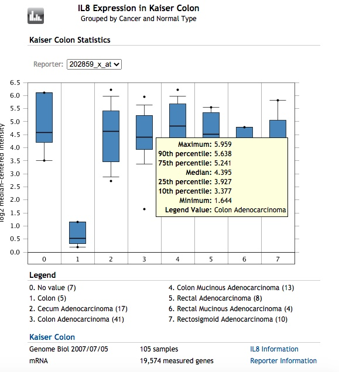

1.  基本介绍

**oncomine**是一个很好的肿瘤数据库，功能很强大，也有可视化的操作，但是最大的问题是数据不能很好的获得，，而且自带的图很丑（而且只是png），关于oncomine的教程有很多，比较经典有解螺旋的教程，比如下面这个，基本涵盖了常用的功能：

-   [麦子陪你做作业（三）：肿瘤经典数据库Oncomine实训操作](https://mp.weixin.qq.com/s/nwOBMA8BMVfmOHL1CM30OQ)

然而，大神[yikeshu0611](https://github.com/yikeshu0611)默默的为我们付出，之前开发了一个R包叫`ROncomine`可以很方便的获得数据，并且再次出图，不过最近又更新为[`oncomineR`](https://github.com/yikeshu0611/oncomineR)了，新版的我还没研究，这里我们还是先说老版的`ROncomine`

这个包以前托管在Github上（由于众所皆知的原因，国内访问Github很困难），但是目前已经删除了，好在我之前已经导入到了我的码云上了，所以也可以很快的安装。

以前其实还有一个教程[破解**oncomine**无法免费下载数据，学员**开发了**一款R语言包 ](https://cloud.tencent.com/developer/news/285412)，但是目前也被删除了，估计这个还是有版权的，所以我还是悄悄的写个自己看的教程

首先需要安装devtools，然后调用install_git函数就可以直接安装,之后就方便了

> install.packages('devtools')
>
> devtools::install_git('[https://gitee.com/swcyo/oncomineR')](https://gitee.com/swcyo/oncomineR'))

其实每一个oncomine的数据都可以使用浏览器获得，用chrome浏览器登录，随便一个地方鼠标右击找到检查元素，就可以看到代码区，使用Crtl+F查找\<map，我们需要的代码全都在\<map那一片，右击复制然后新建一个文本文档保存起来

oncomineR的原理只是是把检查元素里\<map那串代码二次处理，从而简化工作，然后调用ploty作图，当然你也可以用ggplot2再次画图

2.  单基因在基本中的总结（**Gene Summary**）

按照解螺旋的教程，比如搜索**CXCL8**基因，实际上基因名为`IL8`，然后我们可以在右边看到这样的一个热图：


我们复制`<map`那一串代码，保存为`heatmap.txt`文件，我们可以用`Oncomine_heatmap_DiseaseSummaryfor_SomeGene`处理

```{r}
 library(ROncomine)
heat<-Oncomine_heatmap_DiseaseSummaryfor_SomeGene('/Users/mac/Documents/GitHub/myblog/content/post/2021-08-19-oncomine/heatmap.txt') # 命名为heat
knitr::kable(heat) ## 这步是我的教程示例代码，不需要执行
```

这样我们很快的就提取了所有需要的数据，比如我们只想提取`Cancer vs. Normal`，那么可以用R语言处理，也可以用DataEditR交互式处理，或者导出来用excel处理

```{r}
# cn<-heat[heat$`Analysis Type` == 'Cancer vs. Normal',]
# DataEditR::data_edit(heat) # 也可以用交互式编辑
 cn<-read.csv('/Users/mac/Documents/GitHub/myblog/content/post/2021-08-19-oncomine/cn.csv')
knitr::kable(cn)
```

3.  正常与癌症组织比较（**Differential Analysis**）

继续使用解螺旋的示例，用Oncomine分别查询CXCL8在肠癌组织（与正常比）中高表达的数据集和低表达的数据集。筛选条件：P-value：1E-4；Fold Change：3；GENE Rank：Top10%。

这里要注意，默认选择的是子数据，比如Kalser Colon，光标是在Colon Mucinous Adenocarcinoma vs. Normal，这样只是比较肿瘤亚型与正常，这个时候在**Differential Analysis**的GROUP BY是灰白的，如果我们要看所有，就要点击Kalser Colon，然后GROUP BY就可以选择下拉框了，我们选择Cancer and Normal Type，我们可以看到在GROUP里有很多很多的分组，其实就是很多很多的数据，我们想要的都可以提取了

默认的是一个barplot，出现的是直方图，鼠标在柱子上停留就可以看到value，也就是我们需要的\


可以看到有一个箱式图的图标，点一下就变成了Boxplot，鼠标房子Box上可以看到参数



同样的办法，复制\<map代码区并保存为文本文件，比如命名为box.txt,这里其实box和bar的界面结果是一样的，我们在bar里复制，然后使用`Oncomine_bar`函数

```{r}
 box<-Oncomine_bar('/Users/mac/Documents/GitHub/myblog/content/post/2021-08-19-oncomine/box.txt')
knitr::kable(box)
```

我们可以用自带的函数画个图，有两个图，一个是bar_plot，一个是box_plot

```{r}
Oncomine_bar_plot(box)
```

```{r}
Oncomine_box_plot(box)
```
```

当然我们也可以用ggplot2作图

```{r}
library(ggplot2) 
ggplot(box,aes(`Cancer Type`,`Expression value`,color=`Cancer Type`))+
  geom_boxplot()+
  theme_bw(base_size = 12)+
  theme(axis.text.x = element_text(angle=90, hjust=1, vjust=.5))
```


 