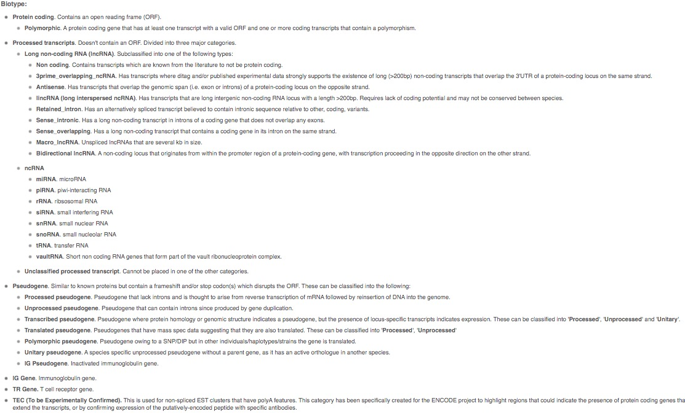

之前我在简书上写了一篇"[如何只下载TCGA肿瘤或正常标本的count](https://www.jianshu.com/p/ebbd22a36d3b)"的教程，原以为没什么人看的。不过这两天简书上有朋友私信我，如何只下载lncRNA的数据。这个功能在**GDCRNATools**里好像上不支持的，因为这个包都是下载全部的RNA数据（包括其他的TCGA工具基本都是只下载RNA数据），具体要区分mRNA和lncRNA是要有专门注释文件的。

我这里想借鉴两种方法，链接在这里：

1.  [利用R代码从UCSC XENA下载mRNA, lncRNA, miRNA表达数据并匹配临床信息](https://zhuanlan.zhihu.com/p/359012216)

2.  [TCGA的ID转换可以一步到位了](https://www.jianshu.com/p/c17373dc052c)

## 如何下载注释文件

我们从TCGA下载的RNA基因，包括从生物公司做全基因测序的结果，一般都有将近6万个基因。默认给的基因名就是**ensembl** 格式（也就是ENSG00开头的基因），当然公司一般都是给你一个注释文件，把你转换成**symbol**格式的基因（比如TP53）。但话多说一句，做富集分析最好选用**entrezid**格式（一串数字）

我们不是要关注怎么转换基因的ID，而是要知道如何下载注释文件，以前有很多眼花缭乱的教程告诉我们怎么去下载注释文件，然而随着生物信息的发展，各种R包层出不穷，完全可以一步就给你转换好。但是转换好了基因，你依旧不知道哪个是mRNA，哪个是lncRNA（或许有，比如tinyarray，但是依然有缺点），因为我们需要的是**注释**，不是**转换**。

我们需要的基因注释文件，常用的叫做[genecode](https://www.gencodegenes.org/)（记得区分物种）。但是这个鬼东西经常更新，我以前用的是v22版，后面又出了v23版，现在官网又有了v38版，但是无论是哪一版，我觉得差不了太多，不过要注意的是不同的版本，注释出来的结果可能也是有细微差异。

### 获得注释文件有以下几种方法：

#### 官网下载 🌟

最好的办法当然是去[官网下载](https://www.gencodegenes.org/human/)最新的GTF文件，但那个东西文件有几十M，还经常下载中断，而我从来没有下载成功过，所以我并不推荐。

#### 找生物公司 🌟 🌟

如果你刚好需要做一个转录组测序，那么生物公司基本都会给你一个**gene.xls**的文件，我之前的那个公司大概是5万8千个基因左右，文件包括有gene_id、gene_name、gene_chr、gene_start、gene_end、gene_strand、gene_length、gene_biotype、gene_description等文件，大概这个样子。

| gene_id         | gene_name  | gene_chr | gene_start | gene_end  | gene_strand | gene_length | gene_biotype                       | gene_description                                 |
|-----------------|------------|----------|------------|-----------|-------------|-------------|------------------------------------|--------------------------------------------------|
| ENSG00000285994 | AL731559.1 | 10       | 12563151   | 12567351  | \+          | 3732        | sense_intronic                     | novel transcript, sense intronic to CAMK1D       |
| ENSG00000285993 | AC018931.1 | 18       | 46409197   | 46410645  | \-          | 1246        | antisense                          | novel transcript, antisense to RNF165            |
| ENSG00000285992 | AC120036.5 | 8        | 47129262   | 47132628  | \+          | 956         | lincRNA                            | novel transcript                                 |
| ENSG00000285991 | AL355312.5 | 6        | 149817937  | 149896011 | \-          | 5065        | protein_coding                     | novel transcript                                 |
| ENSG00000285990 | AL589743.7 | 14       | 19244904   | 19269380  | \-          | 647         | transcribed_unprocessed_pseudogene | neurobeachin (NBEA) pseudogene                   |
| ENSG00000285989 | AL357123.1 | X        | 138558996  | 138559298 | \+          | 303         | TEC                                | TEC                                              |
| ENSG00000285988 | AL392086.3 | 10       | 6737418    | 6840712   | \+          | 614         | lincRNA                            | novel transcript, LINP1-LINC00707 readthrough    |
| ENSG00000285987 | AL157886.1 | 9        | 84316514   | 84657077  | \+          | 3205        | antisense                          |                                                  |
| ENSG00000285986 | BX248415.1 | 1        | 196850283  | 196884793 | \+          | 614         | unprocessed_pseudogene             | complement factor H related 3 (CFHR3) pseudogene |

我上传到了百度网盘

> 链接: <https://pan.baidu.com/s/1VVYMGg6AzLzv-vKpuGkV1A>\
> 密码: 3rnq

#### Xena下载 🌟 🌟 🌟 🌟

UCSC大学有一个[Xena](https://xenabrowser.net/)的网址，以前服务器是国外的，访问不稳定，后面Hiplot跟他们搞了合作，弄了个免费的[Xena中国镜像](https://xena.hiplot.com.cn/)，所以方便了很多，但是目前只有v22版的，但我觉得够用。

随便找个GDC Hub的的数据集，然后随便选一个RNAseq的基因表达类型就可以找到注释文件下载

网址是<https://xena-gdc.hiplot.com.cn/download/gencode.v22.annotation.gene.probeMap>

这里是probeMap格式，可以用excel直接打开的，长这样：

| id                | gene         | chrom | chromStart | chromEnd | strand |
|-------------------|--------------|-------|------------|----------|--------|
| ENSG00000223972.5 | DDX11L1      | chr1  | 11869      | 14409    | \+     |
| ENSG00000227232.5 | WASH7P       | chr1  | 14404      | 29570    | \-     |
| ENSG00000278267.1 | MIR6859-3    | chr1  | 17369      | 17436    | \-     |
| ENSG00000243485.3 | RP11-34P13.3 | chr1  | 29554      | 31109    | \+     |

但是这个表里，并没有biotype，我这里给一个百度云盘的文件，v22版的tsv格式，也可以直接用excel打开

> 链接: <https://pan.baidu.com/s/1juzwlSLXUVEVxpD0cTyCag>
>
> 密码: 1940

这个文件长这个样子：

| gene_id           | gene_name    | seqname | start    | end      | strand | gene_type                          | gene_status | havana_gene          | full_length | exon_length | exon_num |
|-------------------|--------------|---------|----------|----------|--------|------------------------------------|-------------|----------------------|-------------|-------------|----------|
| ENSG00000223972.5 | DDX11L1      | chr1    | 11869    | 14409    | \+     | transcribed_unprocessed_pseudogene | KNOWN       | OTTHUMG00000000961.2 | 2541        | 1735        | 9        |
| ENSG00000238009.5 | RP11-34P13.7 | chr1    | 89295    | 133723   | \-     | lincRNA                            | NOVEL       | OTTHUMG00000001096.2 | 44429       | 3726        | 17       |
| ENSG00000230415.1 | RP5-902P8.10 | chr1    | 1275223  | 1280420  | \+     | lincRNA                            | NOVEL       | OTTHUMG00000002234.2 | 5198        | 513         | 5        |
| ENSG00000236335.1 | RP4-591L5.1  | chr1    | 30409560 | 30411638 | \-     | lincRNA                            | NOVEL       | OTTHUMG00000003682.1 | 2079        | 507         | 3        |
| ENSG00000213842.2 | SUGT1P2      | chr3    | 32752910 | 32753901 | \+     | processed_pseudogene               | KNOWN       | OTTHUMG00000155904.1 | 992         | 992         | 1        |
| ENSG00000227337.1 | AC139452.2   | chr3    | 32785646 | 32786116 | \+     | processed_pseudogene               | KNOWN       | OTTHUMG00000155776.1 | 471         | 471         | 1        |
| ENSG00000206557.5 | TRIM71       | chr3    | 32818018 | 32897826 | \+     | protein_coding                     | KNOWN       | OTTHUMG00000155778.3 | 79809       | 8685        | 4        |

------------------------------------------------------------------------

**PS：**我发现这几个注释文件的基因数量并不一致，甚至mRNA（protein_coding）都有上千个缺口，但我觉得仍然涵盖了我们常用的基因。

## 如何区分mRNA和lncRNA

在开始转换前，我们需要知道mRNA和lncRNA，或者说miRNA到底包括哪些基因？

本文不做科普，想要了解他们的基因类型，可以点击下面这个链接：

[gene and transcript types](http://vega.archive.ensembl.org/info/about/gene_and_transcript_types.html)

大致的介绍如下：

\
有了biotype，可以制作转换成mRNA、lncRNA和miRNA的文件了。在第一篇借鉴文章里作者说他最终汇总到了一个Gene_info.xlsx），但他又偏偏不告诉这个文件在哪里，后面连我自己都忘记了，我是怎么凭一己之力下载到了这个文件，现在分享在百度网盘上

> 链接: <https://pan.baidu.com/s/12oPmYKG-TVi4lhcud5_0JQ>
>
> 密码: n7v0

这里有三个sheet，分别是lncRNA_info（14852）、mRNA_info（18192个）和miRNA_info（1670个），总共算起来有34714个基因。

PS：这里我并没有自己统计，还剩2万5千多个基因是什么，也可能是假基因之类的。

------------------------------------------------------------------------

剩下的，完全可以参照第一篇文章进行注释

### **读入EXCEL文件的gene注释信息，这里用到从biotype上下载好的EXCEL文件**

    # 注释mRNA，lncRNA和miRNA
    mRNA_info <- read.xlsx("./RawData/Gene_info.xlsx",sheet = "mRNA_info")
    lncRNA_info <- read.xlsx("./RawData/Gene_info.xlsx",sheet = "lncRNA_info")
    miRNA_info <- read.xlsx("./RawData/Gene_info.xlsx",sheet = "miRNA_info")

### **根据基因的注释信息，提取对应的表达矩阵**

    ### 统计mRNA
    mRNA_gset <- TCGA_gset[rownames(TCGA_gset) %in% mRNA_info$gene_name,]
    dim(mRNA_gset) 
    write.csv(mRNA_gset,"./TCGA_output/TCGA_HNSC_mRNA.csv",quote = F,row.names = T)
    ### 统计lncRNA
    lncRNA_gset <- TCGA_gset[rownames(TCGA_gset) %in% lncRNA_info$gene_name,]
    dim(lncRNA_gset) 
    write.csv(lncRNA_gset,"./TCGA_output/TCGA_HNSC_lncRNA.csv",quote = F,row.names = T)
    ### 统计miRNA
    miRNA_gset <- TCGA_gset[rownames(TCGA_gset) %in% miRNA_info$gene_name,]
    dim(miRNA_gset)
    write.csv(miRNA_gset,"./TCGA_output/TCGA_HNSC_miRNA.csv",quote = F,row.names = T)

这样就很快的制成了三个表格，分别进行了提取。

## 如何只使用一个R包实现注释和转换

在第二篇文章里，小洁忘了分身写了一个R包，叫做**tinyarray**，可以很好的处理这个问题，然而这个包却托管在Github上，如果你可以正常访问Github当然没有问题，仓库是[xjsun1221/tinyarray](https://github.com/xjsun1221/tinyarray)。

然而我觉得你应该很难安装的，所以我Fork到了我的gitee上面，因此，可以很快的安装

    devtools::install_git('https://gitee.com/swcyo/tinyarray')

中途提示你缺哪个包，你就安装哪个包，目前这个包非常强大，集成了很多很多的功能，可以处理GEO和TCGA的很多数据，还可以很快捷的画火山图、热图、PCA图、生存分析、富集分析等等，ID转换只是其中一个小部分，以后可以写个专门的教程推广一下。

------------------------------------------------------------------------

这里我们需要的gene id是TCGA或者GTEx上的格式，也就是**ensembl** 格式，格式后面可以带点（版本号），也可以不带点，总之就是一个`trans_exp()`函数。

使用这个包的示例文档来说明一下，先随机生成100个基因，其中5个TCGA患者，5个GTEx患者

```{r}
suppressMessages(library(tinyarray)) 
exp = matrix(rnorm(1000),ncol = 10)
rownames(exp) = sample(mRNA_annov23$gene_id,100)
colnames(exp) = c(paste0("TCGA",1:5),paste0("GTEX",1:5))
```

我们简单看一下前几个数据

```{r,echo=FALSE}
knitr::kable(head(exp))
```

这个转换函数是这样的，目前可以转mRNA和lncRNA，可以只转一种，也可以都转.

    trans_exp(exp, mrna_only = FALSE, lncrna_only = FALSE, gtex = FALSE)

#### 如果全部转换，那么代码如下：

```{r}
library(tinyarray)
k=mrna<-trans_exp(exp) #一句话即可
```

#### 如果只转mRNA，那么代码如下：

```{r}
library(tinyarray)
mrna<-trans_exp(exp,mrna_only = T,gtex = T) #有GTEx数据的话，可以加一句gtex = T
```

```{r,echo=FALSE}
knitr::kable(head(mrna))
```

#### 如果只转lncRNA，那么代码如下：

```{r}
lncrna<-trans_exp(exp,lncrna_only = T)
```

由于这个随机的基因里没有lncRNA，所以啥也没有。。。

------------------------------------------------------------------------

用这个包，一步到位，很是方便

-   优点：

    -   **ensembl** 快速转成**symbol**

    -   可以选择只转mRNA还是lncRNA

-   缺点：

    -   没有miRNA

    -   基本不更新
