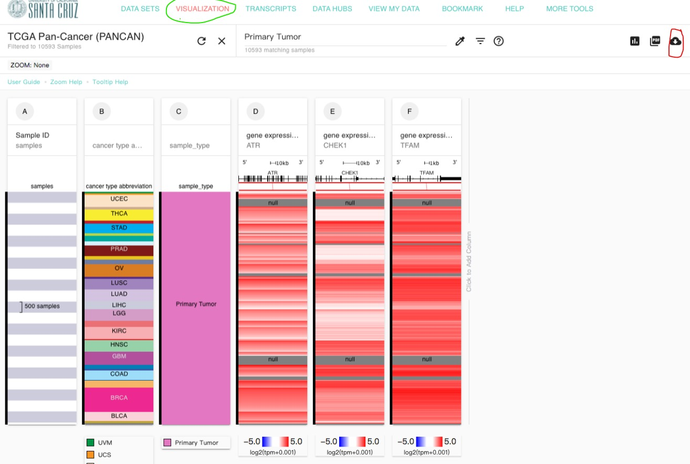

今天一大早（其实快10点了）还在睡觉，李老师问我想知道几个基因在几个TCGA癌症中的相关性。


其实这个问题是很好解决的，我们只要有各种基因在各种癌症的表达量就可以了，然后就是一个相关性分析，图的话就是一个散点图，excel都能做。

可以在线做相关性分析的网址很多，比如xena、ualcan、gepia（官网上的介绍上用非log归一化进行计算，用log归一化进行可视化，好奇怪的设定）、linkedomics、hiplot的在线ucsc-xena-shiny等等，这里我还是推荐xena的可视化分析去提取需要的数据，而且还能下载到本地，自主分析。

对于基因的表达量，以前有count、fpkm和tpm等多种单位，这里推荐用tpm。xena里有一个TCGA Pan-Cancer的数据集，里面有各种基因表达单位，这里推荐用[TOIL RSEM tpm](https://xena.hiplot.com.cn/datapages/?dataset=tcga_RSEM_gene_tpm&host=https%3A%2F%2Fxena-toil.hiplot.com.cn)格式，不过单位是log2(tpm+0.001)，我们可以转换成tpm，也可以转换成log2(tpm+1)，具体有什么差别可以自己体会。

后面我花了几分钟时间就统计好了，然后顺便写个教程描述一下。

---

## 数据的下载

首先从[xena](https://xena.hiplot.com.cn/)的可视化界面下载数据，选择**TCGA Pan-Cancer (PANCAN)**数据集，然后逐渐添加列

-   在Phenotypic里选择cancer type abbreviation（用于筛选肿瘤类型）

-   在Phenotypic里选择sample_type（用于筛选肿瘤组织）

-   在Genomic里输入ATR，基因类型（**gene expression RNAseq**）选择**TOIL RSEM tpm**（单位为log2tpm+0.001）

-   在Genomic里输入CHEK1，基因类型（**gene expression RNAseq**）选择**TOIL RSEM tpm**（单位为log2tpm+0.001）

-   在Genomic里输入TFAM，基因类型（**gene expression RNAseq**）选择**TOIL RSEM tpm**（单位为log2tpm+0.001）

    全部选完以后点击右上角的下载图标，这里也可以先筛选一下Primary Tumor再下载，也可以后面提取。



## 数据的处理

导出的tsv格式里包含里所有的肿瘤类型，我们可以用Excel简单的事先筛选。

-   可以直接用excel先筛选，肿瘤缩写（cancer type abbreviation）选择COAD、OV，PAAD和UCEC，肿瘤类型（sample_type）选择Primary Tumor。当然有些基因表达量有空值，这个可以删除，也先不管，最后保存为csv格式。

-   也可以直接把tsv导入R中处理，但是需要代码，嫌麻烦的话可以不用

## 导入数据

    need<-read.csv("/need.csv") #选择所在的文件夹，事先把列名改成简单的单词

```{r,echo=FALSE}
library(readr)
suppressMessages(need <- read_csv("~/Desktop/李文婷/corr/need.csv"))
```

这样就把COAD、OV，PAAD和UCEC四个肿瘤类型中，ATR、CHEK1和TFAM导入进来了。

## 相关性分析

有一个**ggstatsplot**的包可以很快的统计并绘图，由于有四个肿瘤类型，这里也可以一次性计算，用`grouped_ggscatterstats()`函数实现分面效果。

### 计算ATR和TFAM在四种癌症的相关性

先用默认函数计算一下，这里默认的**pearson**法，先大致看一下效果，见图 \@ref(fig:cor1)

```{r cor1,fig.cap="ATR和TFAM在四种癌症中的pearson相关性分析",fig.align='center',fig.height=10,fig.width=10}
suppressMessages(library(ggstatsplot))
grouped_ggscatterstats(need,#数据名
                       ATR,TFAM, #第一个是x轴，第二个是y轴
                       grouping.var = type,#按type分组，这里本来是cancer type abbreviation
                       plotgrid.args = c(ncol=2) #分面函数，我们只显示两列
                       ) 
```

### 计算CHEK1和TFAM在四种癌症的相关性

继续用默认函数计算，见 图 \@ref(fig:cor2)

```{r cor2,fig.cap="CHEK1和TFAM在四种癌症中的pearson相关性分析",fig.align='center',fig.height=10,fig.width=10}
grouped_ggscatterstats(need,#数据名
                       CHEK1,TFAM, #第一个是x轴，第二个是y轴
                       grouping.var = type,#按type分组
                       plotgrid.args = c(ncol=2) #分面只显示两列
                       ) 
```

可以看到结果还是不错的，都是正相关，这里可能不同的数据库作出的结果不同，这可能是基因表达量单位不一致造成的，我们还是推荐用log2过的TPM。

---

### 适当美化

知乎上有一个很好的教程：[**R绘图：相关性分析与作图（单基因相关性）**](https://zhuanlan.zhihu.com/p/165626910) ，我们照猫画虎可以试着更改一下风格。
