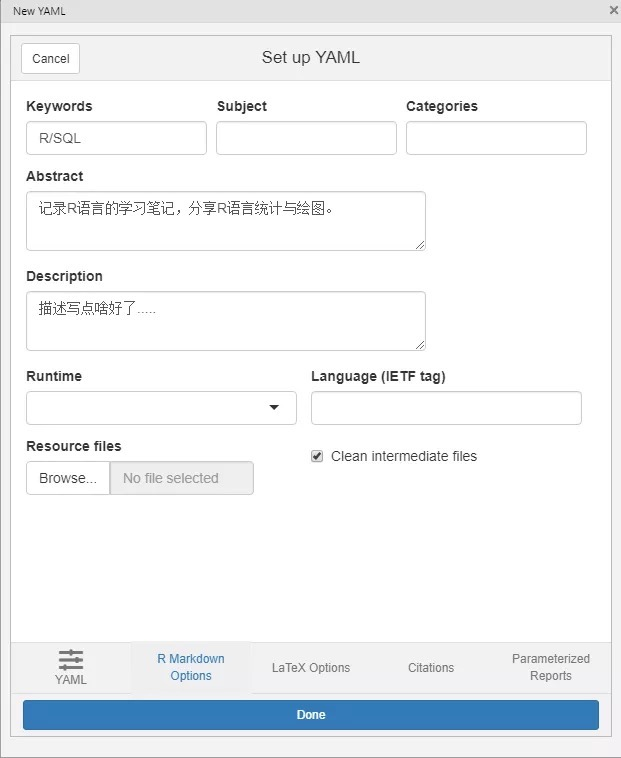
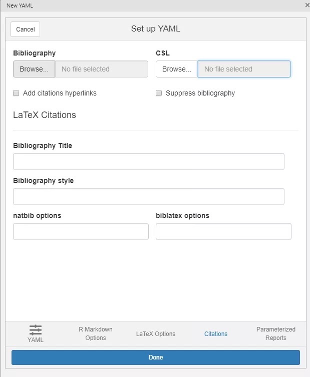
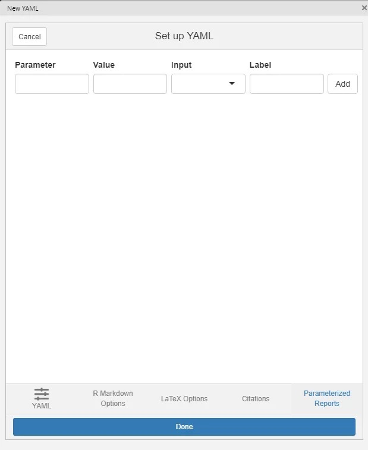

本文来自[超超超级好用的RMarkdown插件 (qq.com)](https://mp.weixin.qq.com/s/bjOjFVh3S59OuMGo5GmdRw)

我们知道Markdown有一个YAML的代码区，是用来定义文章的标题、作者、日期等信息，而Rmarkdown作为一款能够渲染markdown效果的工具，常需要先设置YAML的多种信息，比如关键词、导出哪种格式、是否显示目录等选项，一般情况下需要手动输入代码，这样还是比较麻烦的，因此有人开发了一款可以用来快速设置RMarkdown的YAML文件头的R包，叫"ymlthis"，除了RMarkdown外，blogdown、bookdown和pkgdown也可以使用。

目前**ymlthis**已被**CRAN**收录，可以直接安装，安装成功后会有一个插件，然后手动输入需要的设置即可。

------------------------------------------------------------------------

YAML是Rmarkdown 的头部文件，YAML 定义了rmarkdwon 的性质，比如title、author、date、指定output 文件类型等。

在安装这个R包后会在RStudio的插件栏生成一个插件，如下所示。

下面来看看怎么快速设置RMarkdown的YAML文件头。

首先使用鼠标点击这个插件，在RStudio软件窗口会弹出设置界面。

如上所示，可以看到设置界面底下有五个不同的设置窗口，每个设置窗口上面有不同的详细的参数设置。

下面简单介绍下这些参数设置的意思。

首先左边第一个YAML设置界面。

可以点击设置输出格式，查看具体的参数信息，可以设置是否显示目录，目录的层级，是否显示序号等等。

第二个设置界面主要用来设置关键词、摘要、简单描述等信息。

第三个界面用来设置正文字体颜色、大小、链接颜色等信息。

第四个用来设置参考文献的引用信息。

自己粗略设置下，点击完成即可生成如下界面。

通过鼠标来设置YAML的参数比直接设置代码要明白、方便些。
