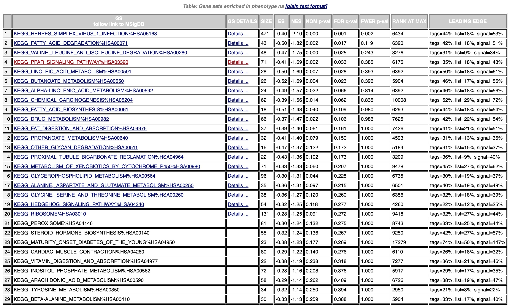

**GSEA**，英文名是`Gene Set Enrichment Analysis`，翻译过来就是**基因富集分析**，与普通的ORA富集分析比较而言，它考虑的不只是显著性改变的基因列表，而是从全局考虑，即使是不显著的基因列表也兼顾了。然而关于如何做GSEA，网上有很多教程，关于排序后的基因集如何做GSEA的教程比较少，本期准备写上几个教程，分别介绍几种使用排序后的值做GSEA的方法。

## 排序值做GSEA分析的方法有哪些？

 
1.  GSEA软件法（本文教程）

2.  R语言法

3.  在线网页法
   

## 一、软件的下载和安装

使用GSEA软件，就需要去[GSEA官网](https://www.gsea-msigdb.org/gsea/downloads.jsp)去下载，这里需要注册一个邮箱即可下载了，现在自己的电脑系统和版本，比如我用的苹果系统，下载的是[`GSEA v4.3.1 Mac App`](https://www.gsea-msigdb.org/gsea/msigdb/download_file.jsp?filePath=/gsea/software/desktop/4.3/GSEA_MacApp_4.3.1.app.zip)这个版本

-   下载完成了直接安装即可。。。

 
<table>
<thead>
<tr class="header">
<th>
系统
</th>
<th>
介绍
</th>
<th>
下载
</th>
</tr>
</thead>
<tbody>
<tr class="odd">
<td>
<strong>GSEA v4.3.1 Mac App</strong>
</td>
<td>
Download and unzip the Mac App Archive then double-click the GSEA application to run it. You can move the app to the Applications folder or anywhere else.
</td>
<td>
<a href="https://www.gsea-msigdb.org/gsea/msigdb/download_file.jsp?filePath=/gsea/software/desktop/4.3/GSEA_MacApp_4.3.1.app.zip">download 
GSEA_MacApp_4.3.1.app.zip</a>
</td>
</tr>
<tr class="even">
<td>
<strong>GSEA v4.3.1 for Windows</strong>
</td>
<td>
Download and run the installer. 
A GSEA shortcut will be created on the Desktop; double-click it to run the application. 
<strong>64-bit Windows is required</strong>
</td>
<td>
<a href="https://www.gsea-msigdb.org/gsea/msigdb/download_file.jsp?filePath=/gsea/software/desktop/4.3/GSEA_Win_4.3.1-installer.exe">download 
GSEA_Win_4.3.1-installer.exe</a>
</td>
</tr>
<tr class="odd">
<td>
<strong>GSEA v4.3.1 for Linux</strong>
</td>
<td>
Download and unzip the Archive. 
See the included readme.txt for further instructions. 
<strong>64-bit Linux is required</strong>
</td>
<td>
<a href="https://www.gsea-msigdb.org/gsea/msigdb/download_file.jsp?filePath=/gsea/software/desktop/4.3/GSEA_Linux_4.3.1.zip">download 
GSEA_Linux_4.3.1.zip</a>
</td>
</tr>
<tr class="even">
<td>
<strong>GSEA v4.3.1 for the 
command line (all platforms)</strong>
</td>
<td>
Download and unzip the Archive. 
See the included readme.txt for further instructions. 
<strong>Requires separate Java 11 installation.</strong>
</td>
<td>
<a href="https://www.gsea-msigdb.org/gsea/msigdb/download_file.jsp?filePath=/gsea/software/desktop/4.3/GSEA_4.3.1.zip">download 
GSEA_4.3.1.zip</a>
</td>
</tr>
</tbody>
</table>

   

## 二、数据的准备

### 基因集和排序值数据

使用[excel](http://)准备数据集，然后另存为制表符分隔的文本文件。保存后，将其后缀改为`.rnk`。这样数据就准备完毕。

要有如下两列数据：

 
1.  基因名列表

2.  排序值（可以差异分析后的FC值或者log2FC值，也可以是具有排序结果的值，比如相关性系数）
   


**ps:** 关于排序值，也就是`pre-ranked值`，很多教程都是直接使用**差异倍数**进行排序，这些我个人觉得有些欠妥，因为差异倍数虽然考虑了差异，但是没有考虑`p值`，很多时候差异倍数和p值并不成对应关系的,比如FC最大的不一定p最小。


 
 - 关于这个问题一直困扰过我，直到我用了[easyGSEA](https://tau.cmmt.ubc.ca/eVITTA/easyGSEA/)这个在线工具时才有了启发，在这里使用的是`-log10(pval)*sign(ES)`的值进行可视化分析，相比而言，我觉得兼顾了p值和ES值，可能更科学一些。
 

 
- 因此我觉得如果是对于差异表达分析基因而言，使用`-log10(pval)*log2FC`值是不是比单纯`log2FC`值更优呢？
 

### GMT数据

进行GSEA，需要准备`.gmt`文件，也就是需要分析的类型，比如GO、KEGG、Wikipathway、Hallmarks等等，这个大家可以去[GSEA官网](https://www.gsea-msigdb.org/gsea/msigdb/human/collections.jsp#H)下载，下载的时候注意`物种`和`基因类型`。当然使用GSEA软件也可以直接选择在线的gmt文件，不过有时候需要看网速，最保险的办法是下载好gmt文件。

另外，也可以在别的地方去下载GMT，比如Wikipathway和KEGG的官网，当然也可以直接制作。

## 三、GSEA软件分析

点击GSEA运行，出现之下界面

### 加载数据

点击**左边第一栏的Load data**加载数据，如果是第一次运行，点**Method 1**，之后点击**Browse for files**，这时候我们把已经制作好的`.rnk`文件和`.gmt`文件加载进来，没有没有报错的话会提示sussess，否则就会报错（error），加载成功后我们可以在**Object cache**的界面中看到`RankedGeneList`和`Gene set databases`，右击这两个文件的话，也可以预览数据。

### 数据分析

使用**左边第二栏**的**Tools**里的`Run GSEAPreranked` 工具进行分析。如果数据集有正常载入，就可以在Ranked List中找到准备好的排序的数据集了，然后选择其他参数：

-   Gene sets database中可以下拉选择自带的数据库，也可以选择Local数据，这时候就加载提前准备好的gmt，有时候由于网络环境可以加载不了自带数据，那么可以断网后直接选择本地数据

-   Collapse我们可以选择No_Collapse

-   默认的出图数量是20个，如果我们想要更多的数量，可以在Advanced fields中设置Plot graph的数量

-   点击下方的三角形Run按钮，就可以开始分析了。

-   在软件左侧的GSEA reports栏中出现success，表示运行结束，点击success可以查看结果报告了。

## 查看和使用结果

GSEA的结果最大的特点是不需要单独分析显著上调或显著下调结果，而且一并运算，因此结果会出现阳性和阴性结果，也就是我们说的激活和抑制的结果。

点击success可以弹出一个html的网页，结果如下，其中na_pos里的结果代表激活的结果，na_neg则代表抑制的结果

在这两部分的结果里，比如在na_neg那片，我们点击Snapshot会出现20个GSEA的图，而点击html文件则可以看到具体的结果，

比如我们点击`PPAR通路`看看结果

------------------------------------------------------------------------

打开通路的html文件，可以发现有很多通路的结果，报告里有ES，NES，p值，FDR值等等，按照有一些文献中解释，NES的绝对值\>1、NOM P 值 \<0.05和FDR值 \<0.25的基因集被认为有显著意义

 
- NES >1、NOM P 值 <0.05和FDR值 <0.25的基因集被认为有正性的显著意义
- NES <-1、NOM P 值 <0.05和FDR值 <0.25的基因集被认为有负性的显著意义
 

到此为止，其实GSEA已经完成了，我们可以直接到本地文件夹去查看所有的结果并且按需发表文章了。

可以看到本地文件夹按照日期生成了数据，打开文件夹后，可以看到一个edb文件夹，还有一大堆的html、tsv和png文件等等，具体的结果可以按需使用。

------------------------------------------------------------------------

 
到这里，完整的**GSEA**分析就真的结束了吗？我们会发现给的png图片的分辨率很低，只有 `72 dpi`，这是远远不能满足`300 dpi`的需求的，而且结果还不能编辑，至于**GSEA的二次绘图**，我们下次再说。。。
   
