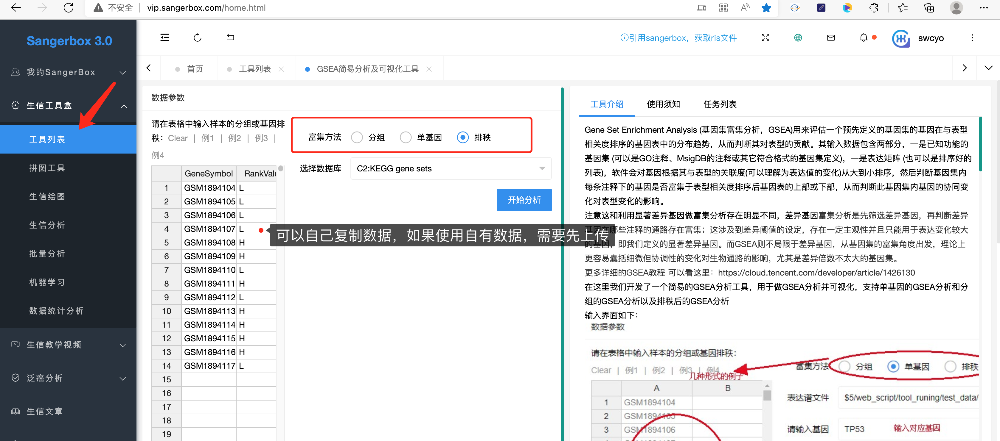
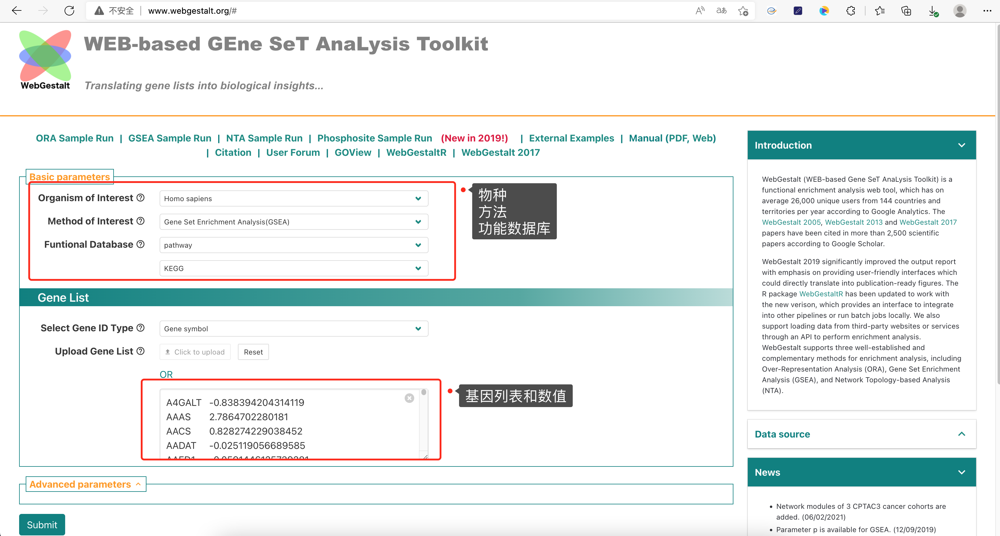

想做GSEA不会R语言，也不想按照GSEA的java软件，那就只能求助于在线网站了，这也是可以实现的，我收集了下面这些在线网站做GSEA。

## 联川生物云

[联川生物云平台](https://www.omicstudio.cn/tool/29)是我早期接触在线网站时最满意的配色工具，配色简约禁欲，功能使用，而且也时常有新的功能更新，你只需要简单的注册就可以使用，而且还有示例文件下载，按照它的要求准备数据，就可以直接出结果，当然内核是**clusterProfiler**包和**enrichplot**包，不过已经有些老了，新的功能没有。

实际上，这个网站完全就是将**clusterProfiler**包shiny化了，一路点点点就可以了，确定就是一次只能画一条曲线。

## 微生信

[微生信 - 在线任意物种，任意基因集富集分析](http://www.bioinformatics.com.cn/plot_basic_gene_set_enrichment_analysis_gsea_analysis_193)其实也是调用**clusterProfiler**包和**enrichplot**包，需要简单注册一下，plot一次需要消耗金币，这个可以画多条曲线，但是仅支持最多绘制6条

## Sangerbox工具

[Sangbox](http://vip.sangerbox.com/home.html)是生信人开发的小工具，生信人曾经开发了一系列生信产品，对于GSEA也有自己独特的小工具，目前新升级的3.0版本网页工具集合很多功能，其中GSEA是基于GSEA的java软件运行，最后将结果进行二次合成，算是比较原汁原味的结果。

这里支持多种方式的GSEA，可以上传基因表达矩阵和分组，也可以上传排序值的genelist，运行的结果可以在后台保存，以方便日后查看。

## Hiplot

[Hiplot](https://hiplot-academic.com/)是集合了一系列生物信息学功能的网站，有基础版和高级版，而GSEA就合成在高级版里，目前已经收录了三组GSEA工具，同时也附有示例文件

1.  [diy-gsea](https://hiplot-academic.com/basic/diy-gsea)：依旧是调用**clusterProfiler**包和**enrichplot**包，可以运行最简单的gseaplot函数图

1.  [advance gsea](https://hiplot-academic.com/advance/gsea)：使用的是java版方法，集成了Broad 基因集，用于基因表达矩阵和分组，后台运行

1.  shiny GSEA：通过潜入shiny网站来运行GSEA，需要上传带有排序值的基因列表，选择相应的基因集，后台自动运行，目前功能很少，只有一个结果，应该是基于**fgsea包**

## 仙桃学术高级版

这个需要买高级版的会员，以前是1999元，现在涨价到2580元，至于没钱的就止步吧，它做的结果也不是那么好看

## easyGSEA

[easyGSEA](https://tau.cmmt.ubc.ca/eVITTA/easyGSEA/)是一个很简单的在线GSEA工具，支持上传基因列表，可以自己选择基因集，也可以下载gmt文件，结果也很不错。同时还支持传统的ORA，包括富集结果，富集网络图和结果下载。

## WebGestalt

[WebGestalt](http://www.webgestalt.org/)又叫WEB-based Gene SeT AnaLysis Toolkit，是一款用来做ORA、GSEA、和NTA的网页工具，同时也是linkedomics的内嵌富集分析工具，功能比较强大，甚至还开发了**WebGestaltR**的包。

 

------------------------------------------------------------------------

以上是我觉得比较好的一些在线GSEA，其中**clusterProfiler**包分析和**enrichplot**包可视化是最常用的嵌入方法，后面有时间单独说说这两个包的应用。
