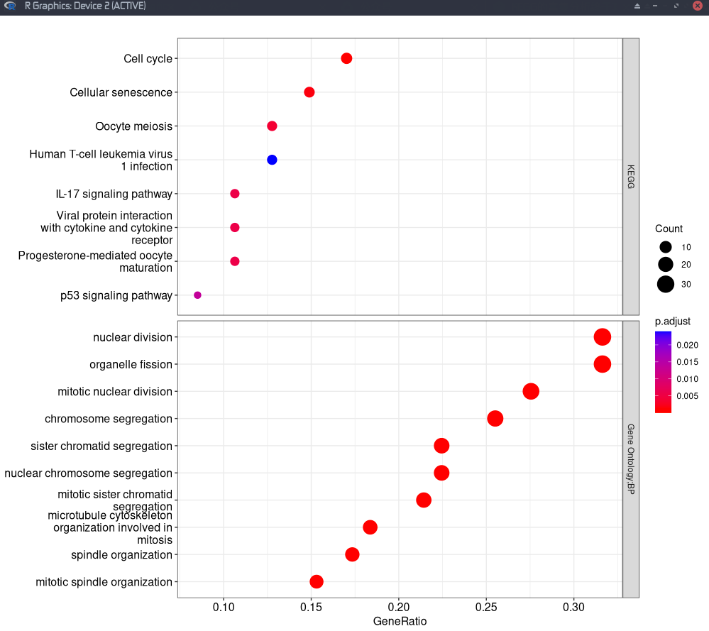
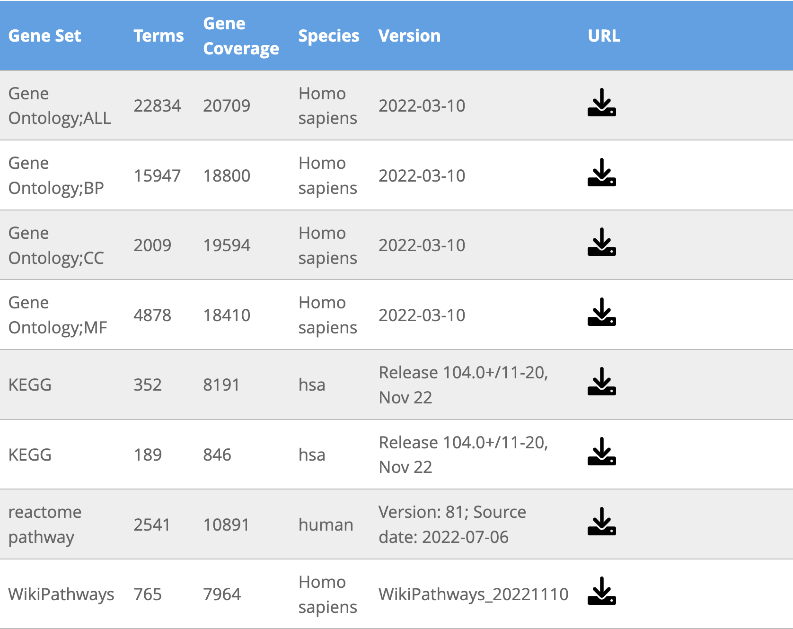

最近Y叔开发了一个**gson**格式的包，制定了一种新的对象标准，并且嵌入到了**clusterProfiler**包里，通过你可以通过`gson_GO()`、`gson_KEGG()`、`gson_WP()`可以在线爬取相应的'GSON'对象，然后可以进行后续的GSEA或者普通的富集分析。

传统的富集分析或者GSEA分析一次只能进行一种结果的分析，比如GO、KEGG、Reactome_human或者WikiPathways。使用**clusterProfiler**包我们可以做到将GO的三组结果进行分面，也可以使用`compareCluster()`将多个基因列表同时进行某一种结果的富集分析，然而却不能将多个结果（比如GO和KEGG）一次性进行分析。

新开发的**gson**包中有一个`gsonList()`函数，可以进行多组富集分析，以list的形式进行组合，然后通过**enrichplot**包中的`autofacet()`函数就可以将多个list的结果。这个教程在[一次搞定所有的富集分析](https://mp.weixin.qq.com/s/17ItITYzILmWv_Hcs80fAA)这个公众号里面。结果如下：



**但是**，这个教程刚出的时候，我就想试试GSEA能不能行，结果发现**enrichplot**包中的`autofacet()`函数并不支持GSEA结果，所以我当天就在Y叔公众号和Github进行了[提问](https://github.com/YuLab-SMU/gson/issues/7#event-7697215884)，经过一个月的等待，终于在前几天收到了解决的邮件。还给我发了一个[测试pdf](https://github.com/YuLab-SMU/enrichplot/files/9894733/test_dotplot.pdf)结果，确实可以分面多个GSEA的结果了。


**不过**，我还是发现一个问题，那就是GSEA本身就包含一个分面，根据NES值分为激活和抑制（这个功能可以通过**ggplot2**的`facet_grid(~.sign)`实现），那么想实现多个富集分析列表的激活和抑制却又卡住了。

> 我发现：
>
> 使用了`autofacet()`，就不能使用`facet_grid(~.sign)`；
>
> 使用了`facet_grid(~.sign)`，就不能使用`autofacet()`。

当然这个Bug可以通过拼接功能实现，但双分面才是我要的结果，这个bug我也已经反映了，不知道什么时候能够解决。

------------------------------------------------------------------------

说完了前言，现在就开始正式演示，我们可以一次性分析BP和KEGG，也可以一次性运行KEGG和Reactome这两种信号通路，或者本文**一次性运行KEGG和WikiPathways这两种信号通路**。

## 获得GSON对象

### GSON库

Y叔的工作网页中制作了一些gson格式的基因集库，我们可以直接下载好并且使用，网址是<https://yulab-smu.top/gson-files/>


**然而**，这个基因集库中还没有收录WikiPathways的结果，并且还需要访问Github才能下载。

所以我重新制作了一下这个库，顺便更新了一下时间，将结果导入到码云Gitee上了，地址是

<http://swcyo.gitee.io/gson-file/>



你也可以这样点击直接下载：

> [Gene Ontology;ALL](https://swcyo.gitee.io/gson-file/GO_ALL_human.gson)
>
> [Gene Ontology;BP](https://swcyo.gitee.io/gson-file/GO_BP_human.gson)
>
> [Gene Ontology;CC](https://swcyo.gitee.io/gson-file/GO_CC_human.gson)
>
> [Gene Ontology;MF](https://swcyo.gitee.io/gson-file/GO_MF_human.gson)
>
> [KEGG](https://swcyo.gitee.io/gson-file/KEGG_human.gson)
>
> [MKEGG](https://swcyo.gitee.io/gson-file/MKEGG_human.gson)
>
> [reactome pathway](https://swcyo.gitee.io/gson-file/Reactome_human.gson)
>
> [WikiPathways](https://swcyo.gitee.io/gson-file/WikiPathways_human.gson)

### 在线GSON

-   我们使用最常用的BP生物学功能和KEGG信号通路进行演示

```{=html}
<!-- -->
```
    library(clusterProfiler)
    BP <- gson_GO(OrgDb = org.Hs.eg.db, keytype = 'ENTREZID', ont = "BP")
    KEGG <- gson_KEGG(species = "hsa", KEGG_Type="KEGG", keyType="kegg") 

如果你想获得目前可获得的所有结果，可以通过**clusterProfiler**的`gson_GO()`，`gson_KEGG()`，`gson_WP()`和**ReactomePA**的`gson_Reactome()`去爬相应背景基因集的最新数据，然后保存到本地使用。代码如下：

    # GO
    library(clusterProfiler)
    library(org.Hs.eg.db)
    library(gson)
    gson_BP_human <- gson_GO(OrgDb = org.Hs.eg.db, keytype = 'ENTREZID', ont = "BP")
    gson_MF_human <- gson_GO(OrgDb = org.Hs.eg.db, keytype = 'ENTREZID', ont = "MF")
    gson_CC_human <- gson_GO(OrgDb = org.Hs.eg.db, keytype = 'ENTREZID', ont = "CC")
    gson_ALL_human <- gson_GO(OrgDb = org.Hs.eg.db, keytype = 'ENTREZID', ont = "ALL")
    write.gson(gson_BP_human, file = "GO_BP_human.gson")
    write.gson(gson_MF_human, file = "GO_MF_human.gson")
    write.gson(gson_CC_human, file = "GO_CC_human.gson")
    write.gson(gson_ALL_human, file = "GO_ALL_human.gson")

    # KEGG
    KEGG_human <- gson_KEGG(species = "hsa", KEGG_Type="KEGG", keyType="kegg") 
    MKEGG_human <- gson_KEGG(species = "hsa", KEGG_Type="MKEGG", keyType="kegg") 
    write.gson(KEGG_human, file = "KEGG_human.gson")
    write.gson(MKEGG_human, file = "MKEGG_human.gson")

    # WikiPathways
    WikiPathways_human <- gson_WP("Homo sapiens") 
    write.gson(WikiPathways_human, file = "WikiPathways_human.gson")

    # Reactome
    library(ReactomePA)
    Reactome_human <- gson_Reactome(organism = "human")
    write.gson(Reactome_human, file = "Reactome_human.gson")

## 加载本地GSON对象

如果通过上述代码把gson文件下载到了本地文件夹，我们可以通过**gson**的`read.gson()`函数进行加载。

    library(gson)
    KEGG<-read.gson("KEGG_human.gson")
    WP<-read.gson("WikiPathways_human.gson")

```{r echo=FALSE, message=FALSE, warning=FALSE}
library(clusterProfiler)
library(gson)
BP<-read.gson('/Users/mac/Documents/GitHub/gson-files/GO_BP_human.gson')
KEGG<-read.gson('/Users/mac/Documents/GitHub/gson-files/KEGG_human.gson')
```

## 运行GSEA

我们使用**DOSE**包中geneList数据列表进行GSEA演示

```{r message=FALSE, warning=FALSE}
library(clusterProfiler)
library(gson)
library(enrichplot)
# 构建gson列表
gsonlist <- gsonList(BP = BP, KEGG=KEGG)
data(geneList,package = 'DOSE')
# 一行运行多组GSEA
GSEA <- GSEA(geneList, 
                 gson = gsonlist,
                 eps=0, # 设置这个可以获得更好的p值
                 pvalueCutoff = 0.9 # p值调大一点
             )
```

## 可视化

使用`dotplot()`对多组GSEA结果绘制点图，但是这个结果把BP和KEGG的两种结果全部都包含了，不能体现出具体的结果，见Figure \@ref(fig:gsea1)所示。

```{r gsea1,fig.cap="多组GSEA结果同时显示"}
dotplot(GSEA)
```

### 自动分面

使用`autofacet()`可以很好的显示分面，默认是按行分面，见Figure \@ref(fig:auto1)所示。

```{r auto1,fig.cap="按行对两种结果进行分面显示"}
dotplot(GSEA,showCategory = 8)+autofacet()
```

我们也可以按列分面

```{r auto2,fig.cap="按列对两种结果进行分面显示"}
dotplot(GSEA)+autofacet(by='col')
```

### Bug

我们知道GSEA是支持以NES为界，分为激活和抑制两个结果的，传统方法是`+facet_grid(~.sign)`，但是`autofacet()`和`+facet_grid(~.sign)`目前只能显示一种结果。

可能是数据有误，只跑出列激活的结果，见Figure \@ref(fig:facet)所示。

```{r facet,fig.cap="显示激活抑制通路"}
library(ggplot2)
dotplot(GSEA)+facet_grid(~.sign)
```

### 解决方法

目前可以通过拼图的方法对两个结果进行处理，见Figure \@ref(fig:mix)所示。

```{r mix,fig.cap="结果拼图"}
library(patchwork)
p1<-dotplot(GSEA$`Gene Ontology;BP`)+facet_grid(~.sign)
p2<-dotplot(GSEA$KEGG)+facet_grid(~.sign)
p1/p2
```

### Barplot

由于Y叔的GSEA还没有开发Barplot的方法，而这个结果也没有看到抑制的结果，可以使用我自己开发的**GSEAbar**这个包进行美化，我设置了`gseabar()`和`gseabar2()`两种显示方法，而且还添加了一些细节。

比如按NES值排序，以p值的颜色显示大小，见Figure \@ref(fig:gseabar)所示。

```{r gseabar,fig.cap="按NES值排序的GSEA柱状图"}
# pak::pak("swcyo/GSEAbar") # 没有安装的可以使用这个代码安装
library(GSEAbar)
p3<-gseabar(GSEA$`Gene Ontology;BP`,
            title = "Gene Ontology;BP", #标题
            n=8,#显示的数量
            length = 45, #文本的长度
            divide = T #结果分开显示
            )
p4<-gseabar(GSEA$KEGG,
            title = "KEGG",
            n=8,
            length = 45,
            reverse = T,#转换一下方向
            divide = T)
p3/p4
```

还可以按-log10的p值排序，但是这个体现不出NES值，见Figure \@ref(fig:gseabar2)所示。

```{r gseabar2,fig.cap="按p值排的GSEA柱状图序"}
p5<-gseabar2(GSEA$`Gene Ontology;BP`,
            title = "Gene Ontology;BP",
            n=8,
            length = 45)
p6<-gseabar2(GSEA$KEGG,
            title = "KEGG",
            n=8,
            length = 45,
            reverse = T)
p5/p6
```

### 其他可视化结果

目前除了`dotplot()`以外，其他的可视化结果均未支持。但是我们可以对列表一个个拼图即可。
