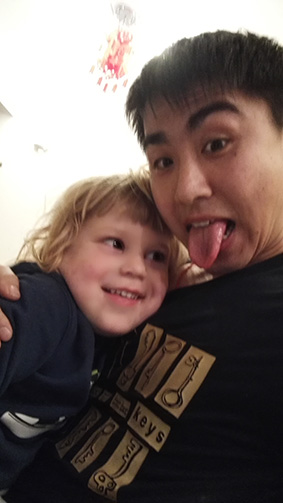

2015年12越很有幸，能够有机会前往以色列进修人类辅助生殖技术。第一次出国，撇足的英语，内向的性格，一直哦读书未知。。

今天冬至，也是第一天来医院报道，医院盛情招待了我会，给我们办好了门禁卡，参观了连环套连环的医院。

晚上大家一起包饺子，大使馆及光明日报王水平记者也来到了我们的villa，其乐融融，晚上Lanna女士带着她的儿女也来了，我很招小朋友喜欢哦。

------------------------------------------------------------------------

