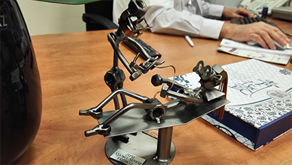
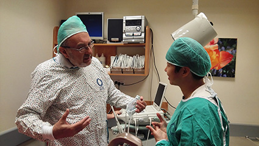
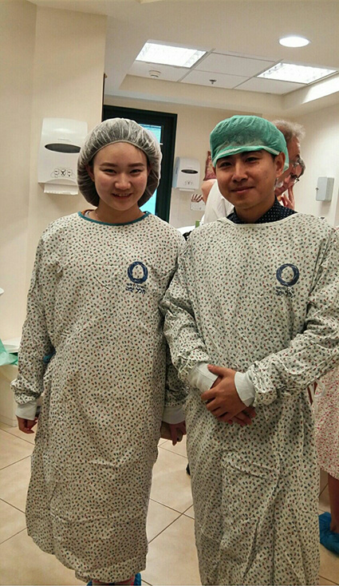

2015年12月22日，我们昨天从北京坐了12个小时的飞机到底特拉维夫后，被直接带到不远的凯撒利亚villa，医院对我们的待遇很好，我们一行七个人，住的都是独栋别墅，有游泳池，有免费wifi。。。

在简单的休息了几个小时以后，今天第一天到来到西勒雅法医学中心参观，第一站就是这里的IVF科室，IVF是In Vitro Fertilization（体外受精）的简称，这里的主任叫Ellenbogen，是一个亲切的老爷爷，对我们都是倾囊相授，很是认真，所以我们都叫他**认真爷爷**。

Ellenbogen教授带我们参观了科室，很亲切，很有激情，科室专业完全不懂，一切都需要从头开始。任重道远。

---

