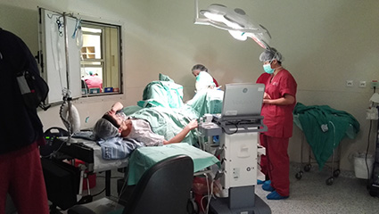

二代试管婴儿的关键就是为排卵困难的女性准备的技术，通过取出卵子，在体外与精子结合，从而达到受孕目的。

今天Ellenbogen教授带我们参观取卵，患者取静脉全麻，截石位，B超引导下穿刺取卵，无回声为卵泡，避开髂内动静脉，两侧单针抽吸，取完后直接送实验室。书写记录，包括并发症，取卵数量等。

一般观察2小时左右如无出血等并发症即可回家，观察患者血压，出血，疼痛等，若出血较多，可口服药物抗感染。

