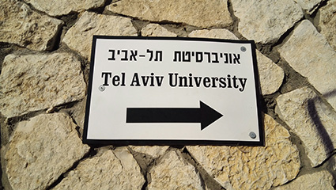

今天跟着李述刚老师去特拉维夫大学开会，特拉维夫为以色列最大的大学，2016年世界排名188名，与山东大学合作开立孔子学院。

今天我们座以色列本地的火车去的，以色列火车很不错，上下两层，火车站有充电器，很方便，星期四和星期天有很多士兵回家，很多士兵背着枪，不分男女，果然全民皆兵。

回来时遇到一个中国湖北来读的研究生，感觉世界很小，不过今天我没去大学，只去了附近的mall - - 女人的地方。

