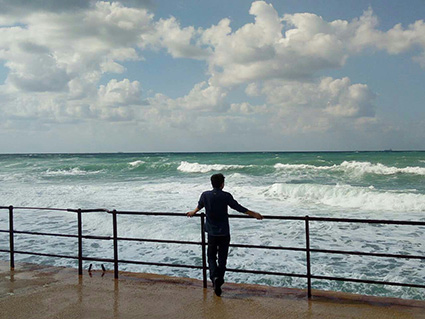
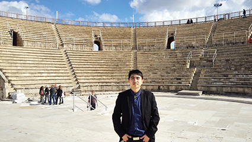
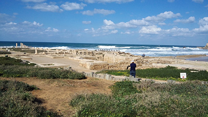

今天是安息日，我们来到了凯撒利亚国家公园，门票40NIS，观看了关于这座城市的过去现在和未来的视频，这座城市见证了几代文明，最终毁于战乱和地震，绝大多数被海水掩埋，如今只能看到一些残垣断壁，参观了古罗马剧院、斗兽场、公共浴室、公共场所等等，曾经这也是一个辉煌的城市，沧海桑田，感慨万千。

今天见了海，这次浪花很大，望向一望无垠的海水，真的是心情愉悦，没有任何烦恼，海风袭来，舒服的很。年少的梦想就是能看海，原来梦想是可以实现的，真希望可以牵手心爱的人走遍全世界。

期间还遇到很多中国人，果然国人是那么的强大。

