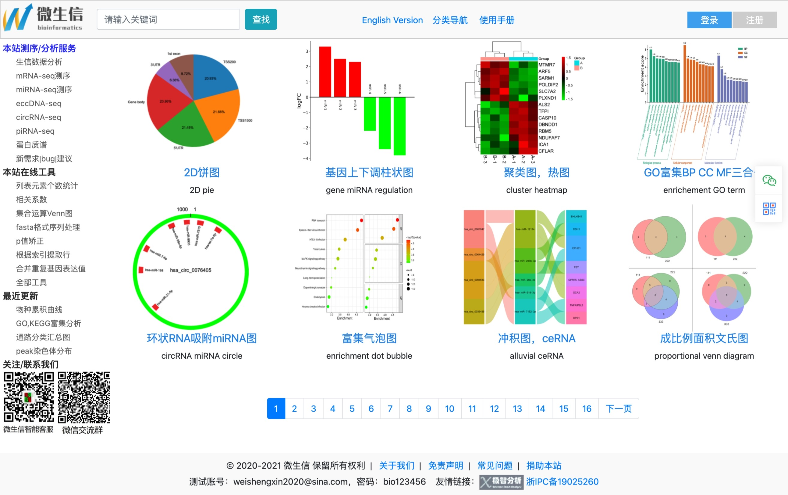
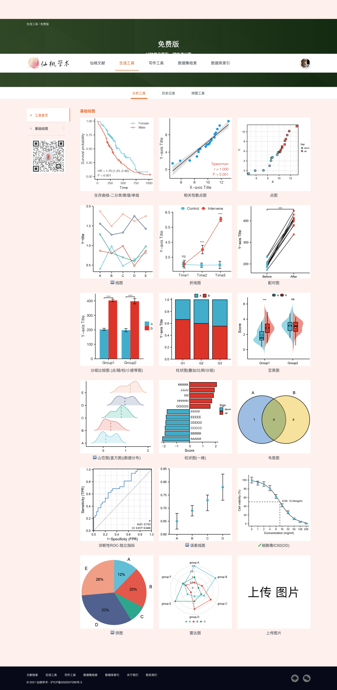

自从入了R的坑，有时候不是不知道怎么去画图，而且纠结于各种细节，比如配色、字体、标签、尺寸之类的事情，经常浪费大量时间。而且画图这种事情，经常需要去背代码，哪怕你不用代码，你也要去找教程。如果有一段时间不使用，有些东西忘的也差不多了，所以能够有在线画图工具，其实是可以节省很多时间的，不过在线画图即使精美，但也缺少很多细节的美感，不过很多工具也是可以满足需要的。

天秤座的人其实很纠结美感的，一般比较丑的工具，我也懒得去推荐，我这里列举一些我觉得很好的画图工具，让你解放一下敲代码的双手：

## 联川生物云平台

[联川工具](https://www.omicstudio.cn/tool)其实我第一个最新接触的画图工具，第一眼给我的感觉就是清晰淡雅，虽然功能不多，但是出的图也确实是精美，而且经过几次的更新，功能也比以前好了很多，你只要注册即可免费使用。

## Hiplot

[Hiplot.com.cn](https://hiplot.com.cn/)是去年国内自发组织的一个免费平台，当年号称是要打造国内最大的生信作图工具，而且目前还在不断的更新中，基本上大家都可以在群里提意见，管理员们也都很热心。现在分为基本模块和进阶模块，包含内容非常丰富，功能异常强大，而且明星产品[UCSCXenaShiny](https://hiplot.com.cn/advance/ucsc-xena-shiny)应用更是有一种无敌的感觉，不仅可以画图，该平台还提供了很多开源书籍📚，又能学又能用。

## SangerBox工具

[SangerBox](http://sangerbox.com/Tool)是老款生信公司[生信人](https://shengxin.ren/)开发的一款在线工具，除了画图以外，其实还可以用来下载GEO数据、TCGA数据、甚至其实还可以用来查文献，另外基因模块也非常强大，基本把单基因在TCGA数据库里研究了遍，全场无脑操作，简直不要太方便，但是我发现他的数据跟别的平台又不完全一致。

目前又有Sangebox3.0网络版工具公测地址，搞得功能这么多，简直有种不需要学习R语言和数据挖掘的感觉。

sangerbox 3.0版

## 微生信

[微生信](http://www.bioinformatics.com.cn/)算是一个颜值比较低的工具了，不过使用很简单，功能还是可以，也可以满足需求。

## 仙桃学术

[仙桃学术](https://www.xiantao.love/)是去年[解螺旋](https://www.helixlife.cn/)推出来的一款工具，对于生信，他家的口号就是"挑、圈、联、靠"四字真经。当时刚推出时吹牛逼是每周更新一些数据库索引，不过我看一个月也没更新多少，不过对于常见图形的工具倒是隔上几个月更新一下。他家的图不是很漂亮，但是也很实用，最关键的是还提供了详细的统计学方法，这倒是别的平台所没有的优势，毕竟是专业医学平台，符合医学上需求。

**BUT**，仙桃学术把人分为了三六九等，免费版的只能换十几种图，而收费版又分为了299元一年的基础版和1999元的终身高级版，收费版可以很无脑的提取TCGA数据进行临床分析，对于我们这些穷人来说，，，，，我只想说一句：谁有账号和经费借我蹭一下好吗

## 临床生信之家

说句心里话，[临床生信之家](https://www.aclbi.com/)是我觉得做TCGA分析最专业的一个工具了，图也很美观，提取临床数据也方便，而且也一直都有更新新的工具，非常好用。

**BUT，**他家比仙桃学术还狠，他只有免费30次的限制，想要再次使用，要么换个微信号登陆，要么掏"巨额"去购买使用次数，最早的时候费用是1999元，而且还不终身。。。

对于这，我只想说。。。申请个课题经费吧！

---

其他还有一些零零散散的工具，比如

-   [Qplottools分析画图工具（本地版）](https://www.yuque.com/qplot/qplottools)

-   号称高颜值免费生物信息在线作图工具但我觉得配色很丑的[ImageGP](http://www.ehbio.com/ImageGP)

-   明明不免费却老说自己免费的[OmicShare Tools](https://www.omicshare.com/tools/)

---

不过如果想一个自己最满意的画图的话，还是离不开R

-   很多生物公司自己开发的生信工具
